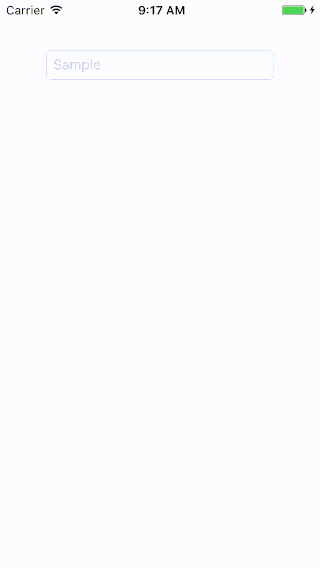

# SBLApplication

[](http://cocoapods.org/pods/SBLApplication)
[](http://cocoapods.org/pods/SBLApplication)
[](http://cocoapods.org/pods/SBLApplication)

## Example

To run the example project, clone the repo, and run `pod install` from the Example directory first.



## Requirements

- Swift 3
- iOS9 or later

## Installation

SBLApplication is available through [CocoaPods](http://cocoapods.org). To install it, simply add the following line to your Podfile:

```ruby
pod "SBLApplication"
```

You also need to introduce `main.swift` with the following code:

```swift
import SBLApplication

UIApplicationMain(
  CommandLine.argc,
  UnsafeMutableRawPointer(CommandLine.unsafeArgv).bindMemory(to: UnsafeMutablePointer<Int8>.self,
                                                             capacity: Int(CommandLine.argc)),
  NSStringFromClass(SBLApplication.self),
  NSStringFromClass(AppDelegate.self) // it should be matched to your AppDelegate class
)
```

and then remove `@UIApplicationMain` from your `AppDelegate`.

## Copyright

[SBLApplication](https://github.com/takkyun/SBLApplication) is developed by Takuya Otani / SimpleBoxes.

Copyright (c) 2012 [SerendipityNZ](http://serendipitynz.com/) Ltd. 

## License

SBLApplication is available under the MIT license. See the LICENSE file for more info.
